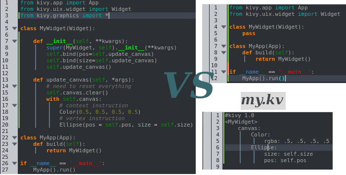

# Kivy-101

## Layouts

Layouts are containers used to arrange widgets in particular order.

- AnchorLayout:
  Widgets can be anchored to the ‘top’, ‘bottom’, ‘left’, ‘right’ or ‘center’.

- BoxLayout:
  Widgets are arranged sequentially, in either a ‘vertical’ or a ‘horizontal’ orientation.

- FloatLayout:
  Widgets are essentially unrestricted.

- RelativeLayout:
  Child widgets are positioned relative to the layout.

- GridLayout:
  Widgets are arranged in a grid defined by the rows and cols properties.

- PageLayout:
  Used to create simple multi-page layouts, in a way that allows easy flipping from one page to another using borders.

- ScatterLayout:
  Widgets are positioned similarly to a RelativeLayout, but they can be translated, rotated and scaled.

- StackLayout:
  Widgets are stacked in a lr-tb (left to right then top to bottom) or tb-lr order.

> Notes:
> Remember when add a widget to a layout, the properties defined in the widget size and position to the parent layout.

- `size_hint` : define the size of the widget as fraction of the parent's size. (0 - 1 floating value) such as 0.01 = 1 / 100 of the parent size (1%)
- `pos_hint` : is used to place the widget relative to parent

## Drawing

Each widget has a `canvas`, it's a place to draw on for the widget.

You can add two types of instruction to the canvas: `contex instructions` and `vertex instructions`. You can add instructions either from python or from kv files (best practice is to put on the kv).



In both cases, the canvas of MyWidget is re-drawn whenever the position or the size of the widget changes.

You can use the canvas.before or canvas.after groups to separate your instructions based on when you want them to be executed.

For an in-depth look at how Kivy’s graphics are handled, look here.

## Event and Properties

One of the most important base classes of the framework is the EventDispatcher class. This class allows you to register event types, and to dispatch them to interested parties (usually other event dispatchers). The `Widget`, `Animation` and `Clock` classes are examples of event dispatchers.

### Main Loop

In Kivy applications, you have to avoid long/infinite loops or sleeping. For example the following code does both:

```python
while True:
    animate_something()
    time.sleep(.10)
```

When you run this, the program will never exit your loop, preventing Kivy from doing all of the other things that need doing. As a result, all you’ll see is a `black window` which you won’t be able to interact with. Instead, you need to “schedule” your `animate_something()` function to be called repeatedly.

### Properties

Properties are an awesome way to define events and bind to them. Essentially, they produce events such that when an attribute of your object changes, all properties that reference that attribute are automatically updated.

There are different kinds of properties to describe the type of data you want to handle.

- StringProperty

- NumericProperty

- BoundedNumericProperty

- ObjectProperty

- DictProperty

- ListProperty

- OptionProperty

- AliasProperty

- BooleanProperty

- ReferenceListProperty

### Declaration of Property

To declare properties, you must declare them at the class level. The class will then do the work to instantiate the real attributes when your object is created. These properties are not attributes: they are mechanisms for creating events based on your attributes:

```python
class MyWidget(Widget):

    text = StringProperty('')
```

When overriding `__init__`, always accept `**kwargs` and use `super()` to call the parent’s `__init__` method, passing in your class instance:

```python
def __init__(self, **kwargs):
    super(MyWidget, self).__init__(**kwargs)
```

### KV Language

The KV language, sometimes called kvlang or the kivy language, allows you to create your widget tree in a declarative way and to bind widget properties to each other or to callbacks in a natural manner. It allows for very fast prototypes and agile changes to your UI. It also facilitates separating the logic of your application and its User Interface.

#### Load KV

There are two ways to load Kv code into your application:

- By name convention:
  Kivy looks for a Kv file with the same name as your App class in lowercase, minus “App” if it ends with ‘App’ e.g:

```python
MyApp -> my.kv
```

If this file defines a Root Widget it will be attached to the App’s root attribute and used as the base of the application widget tree.

- Builder: You can tell Kivy to directly load a string or a file. If this string or file defines a root widget, it will be returned by the method:

```python
Builder.load_file('path/to/file.kv')
```

#### Rule Context

A Kv source constitutes of rules which are used to describe the content of a Widget. You can have one root rule, and any number of class or template rules.

The root rule is declared by declaring the class of your root widget, without any indentation, followed by : and will be set as the root attribute of the App instance:

```
Widget:
```

A class rule, declared by the name of a widget class between < > and followed by :, defines the appearance and behavior of any instance of that class:

```
<MyWidget>:
```

There are three keywords specific to the Kv language:

- `app`: always refers to the instance of your application.

- `root`: refers to the base widget/template in the current rule

- `self`: always refer to the current widget

### Importing Special Package in KV

There is a special syntax to define values for the whole Kv context.

To access Python modules and classes from kv, use #:import

```
#:import name x.y.z
#:import isdir os.path.isdir
#:import np numpy
```

is equivalent to:

```python
from x.y import z as name
from os.path import isdir
import numpy as np
```

in Python.

To set a global value, use #:set

```
#:set name value
```

is equivalent to:

```python
name = value
```
